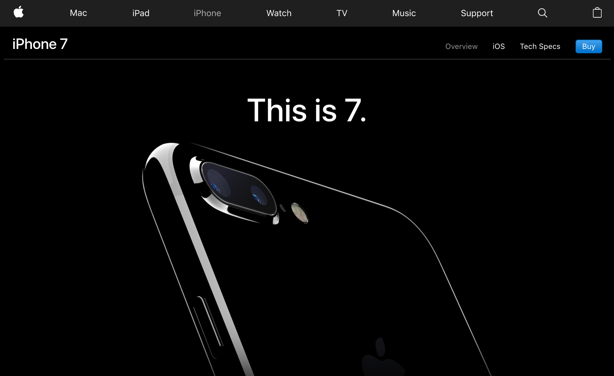
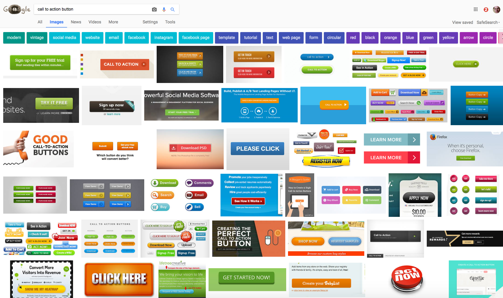
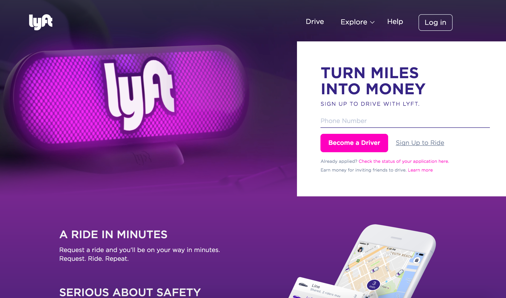
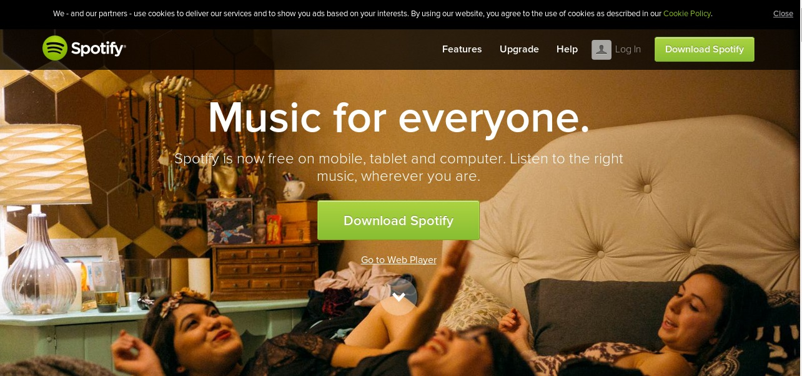
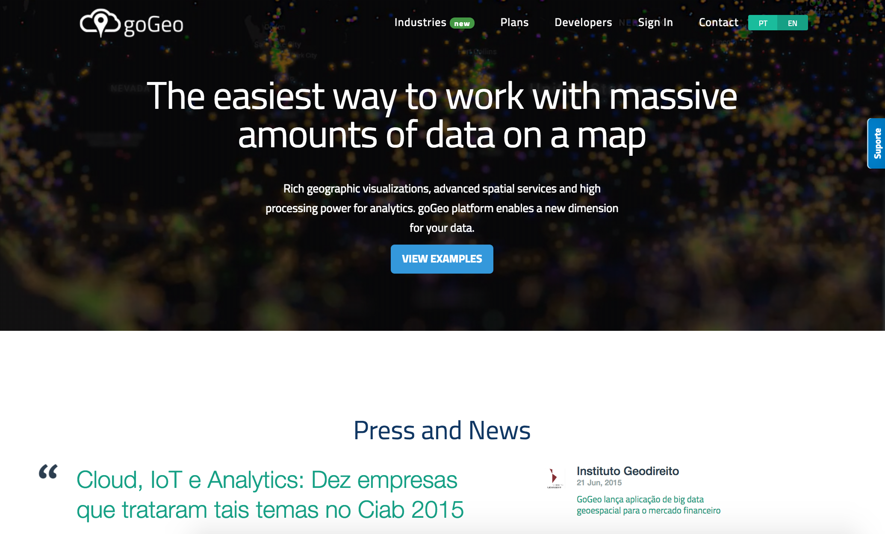

# Kasutajaliideste kavandamine

### MTAT.03.032

R 28. aprill, teine kohtumine

---

# Slaidid

### http://kristjanjansen.ee/kasutajaliidesed2

&nbsp;

---

# Kursuse osad

|||
|----|----|----|
|**~~R 21. aprill~~**|~~Visuaalne disain~~|
|**R 28. aprill**|Interaktsioonidisain|
|**_K 17.mai 12:00_**|**_Kodutöö esitamine_**|
|**R 19. mai**|Disaineri tööprotsess|
|**R 26. mai**|Kasutajaliideste tulevik|

---

# Kursuse hinne

**Kolm kohalkäimist** on kohustuslik

**Kodutöö** annab maksimaalselt 100 punkti

**Neli kohalkäimist** annab 20 punkti lisaks

Ainest saab läbi vähemalt 50 punktiga

---

# Kodutöö

Väikesed töögrupid, 2-3-4 liiget

Töö esitamine kirjalik, raporti vormis

Teema anname ja grupid moodustame tänase kohtumise lõpus

---

# Tänane kava

|||
|----|----|----|
|**10:15**|Loeng suures saalis, ruum nr 111|1 tund|
|_**11:15**_|🌬️ _**Paus**_|_**10 min**_|
|**11:25**|Loeng suures saalis jätkub, ruum nr 111|1 tund|
|_**12:25**_|🍴 _**Paus**_|_**45 min**_|
|**13:10**|Praktiline töö eri ruumides|1 tund|
|_**14:10**_|🌬️ _**Paus**_|_**5 min**_|
|**14:15**|Praktiline töö eri ruumides jätkub|1 tund|
|**15:15**|Päeva kokkuvõte ja kodutöö tutvustus suures saalis|30 min|

---

# Interaktsioonidisain

_**Elemente millega tegeleb interaktsioonidisainer on palju.**_
_**Täna keskendume:**_

1. Nupud ehk *Actions & Controls*

2. Navigatsioon

3. Vormid

---

# 1. Nupud

&nbsp;

---

# Vajuta nuppu!

|||
|---|---|---|
|**_Lühike vajutus_**|Kasutan Androidi|
|**_Lühike topeltvajutus_**|Kasutan iOS'i|
|**_Pikk vajutus_**|Kasutan Windows Phone'i|

---

https://www.youtube.com/watch?v=YtQJIioQ4-k

---

# Mis on kõige tähtsam nupp (veebis)?

&nbsp;

---

# Call to **_action_**

---

---

---

# Call to Action nupp

**Kontrast:** selge hierarhia ja eristuv värv

**Paigutus:** koheselt nähtav

**Foto suunatus:** inimene jälgib teise inimese pilku

**Tekst:** Isikupärane ja kutsuv

### ?

**Ajalisus:** kohe saab otsa!

**Power words:** maagilised ostmakutsuvad sõnad

https://sumo.com/stories/power-words

---

---

---

---

---

---

---

---

---

---

---

---

# Praktiline ülesanne

Pane järjekorda

---

---

---

---

---

# Praktiline ülesanne

Pane järjekorda

http://gogeo.io/

https://papertrailapp.com/

https://www.loggly.com/

https://logentries.com/

---

# 2. Navigatsioon

https://cmd-t.webydo.com/from-simple-to-unusual-a-look-at-navigation-in-web-design-1057d0baef7b

# Navigation

---

---

---

---

# Amazon

---

https://www.slideshare.net/LukaszPrzywarty/hamburgerless-on-creative-mobile-navigation

---

Hamburger

Kebab

Döner

Meatballs

Bento

---

# Vormid

# Rachel Andrew

CSS grids

---

# sarasoueidan

SVG

---

Chris Coyier

Flexbox

---

# Forms

---

---

https://www.lukew.com/
https://twitter.com/lukew

---

https://www.lightningdesignsystem.com/guidelines/data-entry/

http://carbondesignsystem.com/components/form/usage

http://govuk-elements.herokuapp.com/ 

https://standards.usa.gov/components/form-controls/#text-input

---

https://www.gov.uk/service-manual/design/form-structure

---
Errors

https://material.io/guidelines/patterns/errors.html#errors-user-input-errors

---

http://carbondesignsystem.com/components/form/usage

---

https://material.io/guidelines/components/text-fields.html#text-fields-layout

---

https://baymard.com/blog/mobile-form-usability-single-input-fields

---

Input mask

https://youtu.be/xiyOTcVHqHw?t=1h4m20s

---

https://developers.google.com/web/fundamentals/discovery-and-monetization/payment-request/
https://developers.google.com/web/updates/2016/07/payment-request
https://www.youtube.com/watch?v=hmqZxP6iTpo

---

https://stripe.com/docs/elements/examples

---

---

# Apple Pay

https://support.apple.com/library/content/dam/edam/applecare/images/en_US/applepay/macos-sierra-ios10-3-iphone7-safari-applepay.jpg

---

# PaymentsRequest API

---

# Floating label pattern

https://material.io/guidelines/components/text-fields.html#text-fields-states

Matt D. Smith

http://mds.is/float-label-pattern/

---

Dash

---

# Natural-Stretch-Ow

http://scotthurff.com/posts/how-to-design-for-thumbs-in-the-era-of-huge-screens

---

---

