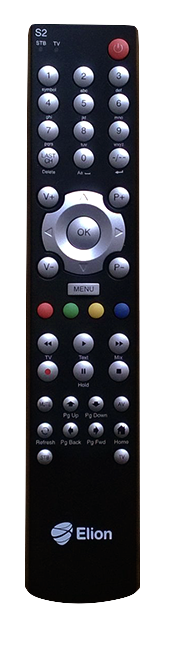
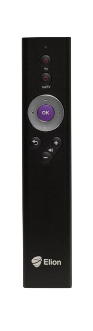

# Elioni pult

---

---

---

---

# 2013

---

https://www.youtube.com/watch?v=0zlEin99ynQ

---

---

http://www.vastused.ee/loe/kodu-ja-kontoritehnika/tv-audio-video-fototehnika/8513/miks-elioni-uuenenud-nutitv.html

---

---

Uue põlvkonna võimsam digiboks muudab nutiTV senisest veelgi kiiremaks ning raadiosagedusel töötavate pultidega ei pea digiboks enam olema otsenähtavuses. 

"Oleme oma klientide hulgas viinud läbi kasutajatestid, mille tulemusena selgus, et pooled klientidest soovisid numbritega puldilahendust ning teine pool oli aga väga rahul praeguse lihtsa puldi kasutamisega. Tulenevalt sellest lisasime valikusse numbritega puldi ning täiendasime veelgi lihtsa puldi funktsionaalsust," selgitas Elioni televisiooni ja multimeedia valdkonna juht Karl Anton. 

http://foorum.hinnavaatlus.ee/viewtopic.php?p=8386942

---

